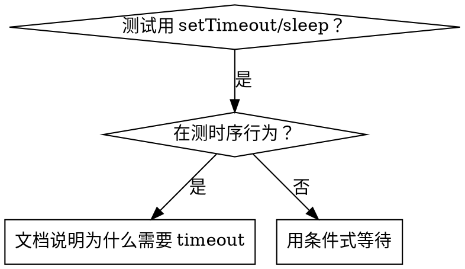

# 条件式等待

## 概述

不稳定的测试经常用任意延时猜时机。这制造了竞态条件——快机器上测试通过，但负载下或 CI 里失败。

**核心原则**：等你在意的实际条件，而不是猜它要多久。

## 何时使用



**使用当：**
- 测试有任意延时（`setTimeout`、`sleep`、`time.sleep()`）
- 测试不稳定（有时通过，负载下失败）
- 并行跑时超时
- 等待异步操作完成

**不要使用当：**
- 测真实的时序行为（debounce、throttle 间隔）
- 若用任意 timeout，始终文档说明为什么

## 核心模式

```typescript
// ❌ 之前：猜时机
await new Promise(r => setTimeout(r, 50));
const result = getResult();
expect(result).toBeDefined();

// ✅ 之后：等条件
await waitFor(() => getResult() !== undefined);
const result = getResult();
expect(result).toBeDefined();
```

## 快速模式

| 场景 | 模式 |
|----------|---------|
| 等事件 | `waitFor(() => events.find(e => e.type === 'DONE'))` |
| 等状态 | `waitFor(() => machine.state === 'ready')` |
| 等数量 | `waitFor(() => items.length >= 5)` |
| 等文件 | `waitFor(() => fs.existsSync(path))` |
| 复杂条件 | `waitFor(() => obj.ready && obj.value > 10)` |

## 实现

通用轮询函数：
```typescript
async function waitFor<T>(
  condition: () => T | undefined | null | false,
  description: string,
  timeoutMs = 5000
): Promise<T> {
  const startTime = Date.now();

  while (true) {
    const result = condition();
    if (result) return result;

    if (Date.now() - startTime > timeoutMs) {
      throw new Error(`等待 ${description} 超时（${timeoutMs}ms 后）`);
    }

    await new Promise(r => setTimeout(r, 10)); // 每 10ms 轮询
  }
}
```

领域特定辅助函数（如 `waitForEvent`、`waitForEventCount`、`waitForEventMatch`）可基于上述 `waitFor` 封装：

```typescript
// 等待事件发射
async function waitForEvent<T>(
  emitter: { on: (event: string, cb: (payload: T) => void) => void },
  eventType: string,
  timeoutMs = 5000
): Promise<T> {
  return waitFor(
    () => new Promise<T>(resolve => emitter.on(eventType, resolve)),
    `事件 ${eventType}`,
    timeoutMs
  );
}

// 等待事件达到指定数量
async function waitForEventCount(
  events: unknown[],
  count: number,
  timeoutMs = 5000
): Promise<void> {
  await waitFor(
    () => events.length >= count ? events.length : undefined,
    `${count} 个事件`,
    timeoutMs
  );
}
```

## 常见错误

**❌ 轮询太快：** `setTimeout(check, 1)` - 浪费 CPU
**✅ 修复：** 每 10ms 轮询

**❌ 没 timeout：** 条件永远不满足就死循环
**✅ 修复：** 始终带清晰错误的 timeout

**❌ 数据陈旧：** 循环前缓存状态
**✅ 修复：** 循环内调 getter 取新鲜数据

## 当任意 timeout 才是正确的时候

```typescript
// 工具每 100ms tick - 需要 2 个 tick 验证部分输出
await waitForEvent(manager, 'TOOL_STARTED'); // 先：等触发条件
await new Promise(r => setTimeout(r, 200));   // 后：等时序行为
// 200ms = 100ms 间隔的 2 个 tick - 有文档说明和依据
```

**要求：**
1. 先等触发条件
2. 基于已知时序（不是猜）
3. 注释解释为什么

## 现实影响

来自调试会话（2025-10-03）：
- 修了 3 个文件里的 15 个不稳定测试
- 通过率：60% → 100%
- 执行时间：快了 40%
- 不再有竞态条件
