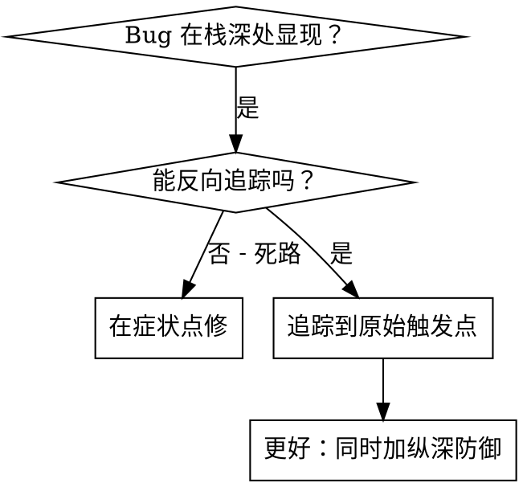
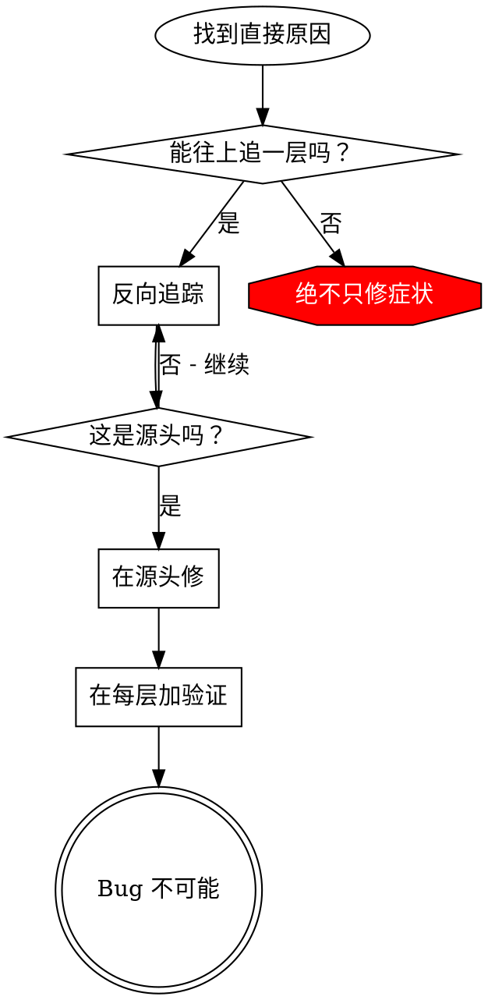

# 根因追踪

## 概述

Bug 经常在调用栈深处显现（git init 在错误目录、文件创建在错误位置、数据库用错误路径打开）。你的本能是在错误显现的地方修，但那是在治症状。

**核心原则**：沿调用链反向追踪直到找到原始触发点，然后在源头修复。

## 何时使用



**使用当：**
- 错误发生在执行深处（不在入口）
- 栈 trace 显示长调用链
- 不清楚无效数据从哪起源
- 需要找哪个测试/代码触发了问题

## 追踪流程

### 1. 观察症状
```
Error: git init failed in ~/project/packages/core
```

### 2. 找直接原因
**什么代码直接导致了这个？**
```typescript
await execFileAsync('git', ['init'], { cwd: projectDir });
```

### 3. 问：谁调了这个？
```typescript
WorktreeManager.createSessionWorktree(projectDir, sessionId)
  ← 由 Session.initializeWorkspace() 调用
  ← 由 Session.create() 调用
  ← 由 Project.create() 处的测试调用
```

### 4. 持续往上追
**传了什么值？**
- `projectDir = ''`（空字符串！）
- 空字符串作为 `cwd` 解析为 `process.cwd()`
- 那是源代码目录！

### 5. 找原始触发点
**空字符串从哪来？**
```typescript
const context = setupCoreTest(); // 返回 { tempDir: '' }
Project.create('name', context.tempDir); // 在 beforeEach 之前访问！
```

## 加栈 trace

无法手动追踪时，加仪表：

```typescript
// 在出问题的操作之前
async function gitInit(directory: string) {
  const stack = new Error().stack;
  console.error('DEBUG git init:', {
    directory,
    cwd: process.cwd(),
    nodeEnv: process.env.NODE_ENV,
    stack,
  });

  await execFileAsync('git', ['init'], { cwd: directory });
}
```

**关键：** 测试里用 `console.error()`（不要用 logger——可能不显示）

**运行并捕获：**
```bash
npm test 2>&1 | grep 'DEBUG git init'
```

**分析栈 trace：**
- 找测试文件名
- 找触发调用的行号
- 识别模式（同一个测试？同一个参数？）

## 找哪个测试造成污染

若测试期间出现了某现象但不知道哪个测试，用**二分法**逐个排查：

1. 把测试列表对半分，先跑前半部分，检查现象是否出现
2. 出现 → 污染者在前半；未出现 → 污染者在后半
3. 对有问题的半部分重复二分，直到锁定单个测试

或者逐个跑测试，停在第一个污染者：

```bash
# 逐个运行测试文件，检查目标现象是否出现
for test_file in src/**/*.test.ts; do
  echo "=== Running: $test_file ==="
  # 运行该测试并检查是否产生了目标现象（如 .git 被创建）
  npx jest "$test_file" 2>&1 | grep -q '目标现象'
  if [ $? -eq 0 ]; then
    echo ">>> 污染者: $test_file"
    break
  fi
done
```

## 真实示例：空的 projectDir

**症状：** `.git` 创建在 `packages/core/`（源代码目录）

**追踪链：**
1. `git init` 在 `process.cwd()` 运行 ← 空的 cwd 参数
2. WorktreeManager 被传空的 projectDir
3. Session.create() 传了空字符串
4. 测试在 beforeEach 之前访问了 `context.tempDir`
5. setupCoreTest() 初始返回 `{ tempDir: '' }`

**根因：** 顶层变量初始化时访问了空值

**修复：** 把 tempDir 改成 getter，在 beforeEach 之前访问会抛错

**同时加了纵深防御：**
- 第 1 层：Project.create() 验证目录
- 第 2 层：WorkspaceManager 验证非空
- 第 3 层：NODE_ENV 守卫拒绝在 tmpdir 之外 git init
- 第 4 层：git init 前记录栈 trace

## 关键原则



**绝不只在错误显现的地方修。** 追回去找原始触发点。

## 栈 trace 技巧

**测试里：** 用 `console.error()` 不要用 logger——logger 可能被压制
**操作前：** 在危险操作前记录，不要在它失败后
**含上下文：** 目录、cwd、环境变量、时间戳
**捕获栈：** `new Error().stack` 显示完整调用链

## 现实影响

来自调试会话（2025-10-03）：
- 通过 5 层追踪找到根因
- 在源头修（getter 验证）
- 加了 4 层防御
- 1847 个测试通过，零污染
