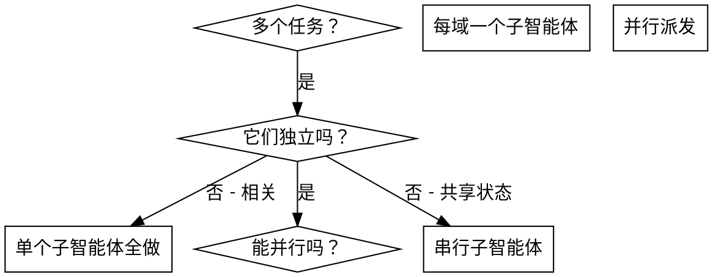

# 派发并行子智能体

## 概述

你把任务委派给具有隔离上下文的子智能体（通过子智能体调度）。通过精确构造它们的指令和上下文，你确保它们保持专注并在任务上成功。它们绝不继承你会话的上下文或历史——你构造它们需要的恰好内容。这也保留你自己的上下文用于协调工作。

当你有多个不相关的任务（不同模块、不同功能、不同文件），顺序执行浪费时间。每个任务独立，可以并行。

**核心原则**：每个独立问题域派发一个子智能体。让它们并发工作。默认并行，只有命名的依赖才串行。

## 任务来源

任务 = Issue 验收 checklist 的条目（AC），或从技术方案"详细设计"拆出的实现单元。每个 AC 必须能独立表述预期结果；表述不了的先回技术方案补拆。

## 何时使用



**使用当：**
- 2+ 任务触及不同模块/文件
- 多个功能独立实现
- 每个任务无需其他任务的上下文就能理解
- 实现间无共享状态

**不要使用当：**
- 任务相关（一个的输出是另一个的输入）
- 需要理解完整系统状态
- 子智能体会编辑同一文件（冲突风险）

## 模式

### 1. 识别独立域

按触及面分组任务（例：Issue #12 支付模块）：
- 任务 A：Domain 层（src/modules/Payment/Domain/）
- 任务 B：Application 层（src/modules/Payment/Application/）
- 任务 C：Interface 层（src/modules/Payment/Interfaces/）

### 2. 创建聚焦的子智能体任务

每个子智能体获得：
- **具体范围**：一个模块/文件/功能
- **清晰目标**：让对应 AC 通过
- **约束**：不改其他模块代码
- **预期输出**：实现了什么 + 编译/类型检查结果摘要

### 3. 并行派发

```
子智能体 A ← AC1（并行）
子智能体 B ← AC2（并行）
子智能体 C ← AC3（并行）
全部派发放同一条消息，真正并发
```

### 4. 审查与集成

子智能体返回后：
- 读每个摘要，核对 EXPECTED OUTCOME
- 验证实现互不冲突（是否编辑了同一文件）
- 编译/类型检查确认（**不跑任何测试**——单元也一样，lint 与一切测试由 PR CI 在干净环境执行）

## 验证分层纪律（本地静态确认 vs CI 测试）

- **本地静态确认**：build、typecheck——编译级，秒级、无环境依赖，子智能体与集成检查只用它
- **CI 测试**：lint + 一切测试（单元/集成/API/E2E/VRT/性能）——**agent 与子智能体一律不跑**，全部由 PR CI 在干净环境执行（避免本地端口占用/进程打架，并行开发多模块时尤甚）
- 证明级别匹配声称级别：本地证明 = 编译/类型检查输出；测试类声称的证明 = PR CI run 链接
- 派发 prompt 的 VERIFY 段必须显式写"不跑任何测试"，防子智能体自行跑测试卡住流程

## 子智能体 prompt 结构（6 段式，全部必填）

```markdown
## 1. TASK
[对应 Issue #N 验收 checklist 的某条 AC。要极其具体。]

## 2. EXPECTED OUTCOME
- 创建/修改的文件：[精确路径]
- 功能：[精确行为]
- 验证：编译/类型检查通过（不跑任何测试）

## 3. REQUIRED CONTEXT
[从 PRD/技术方案/原型提取该任务相关片段——只贴相关的。]

## 4. MUST DO
[AGENTS.md 里适用于该任务的项目约定]

## 5. MUST NOT DO
[反模式。如：不要修改其他模块 / 不要加未要求的依赖 / 不要跑任何测试（含单元测试）]

## 6. VERIFY
运行编译/类型检查（不跑任何测试——lint 与一切测试都在 PR CI），附真实输出
```

## 常见错误

**❌ 太广：** "修所有 AC" - 子智能体会迷失
**✅ 具体：** "实现 AC1：创建 payments 表迁移" - 范围聚焦

**❌ 没上下文：** "实现迁移" - 子智能体不知道约定
**✅ 有上下文：** 贴上项目约定和参考文件

**❌ 没约束：** 子智能体可能重构一切
**✅ 有约束：** "不要修改其他模块"/"只创建迁移文件"

**❌ 输出模糊：** "搞定" - 你不知道改了什么
**✅ 输出具体：** "返回创建的文件摘要 + 编译/类型检查真实输出"

## 不要使用的情况

**相关任务**（一个的输出是另一个的输入）→ 串行；**需要完整系统上下文** → 主 Agent 自己做或拆细；**探索性工作**（还不知道什么坏了）→ 先诊断；**共享状态/同文件** → 串行。

## 真实示例

**场景：** Issue #12 "订单 API" 验收 checklist 有 5 条 AC，对应 5 个实现单元

**决策：** Domain/Application/Interface/Infrastructure 各在不同目录，可并行；路由注册依赖前 4 个的类名

**派发：**
```
子智能体 1 → AC1 Domain 层      ┐
子智能体 2 → AC2 Application 层  │ 同一条消息并行派发
子智能体 3 → AC3 Interface 层    │
子智能体 4 → AC4 Infrastructure  ┘
[等待全部完成]
主 Agent → AC5 注册路由（依赖前 4 个的类名）
```

**集成：** 4 个独立目录无冲突；编译/类型检查确认协同；一切测试留给 PR CI。

## 与 shw-apply 的集成

此 skill 是 `/shw-apply` 的决策层：
1. 读 Issue 验收 checklist + 技术方案
2. 用此 skill 识别并行组
3. 用 6 段式 prompt 并行派发
4. 收集结果 → 核对 → 编译级协同确认
5. 审查收敛交 shw-pr-review，CI 门禁交 shw-gitea-ci
