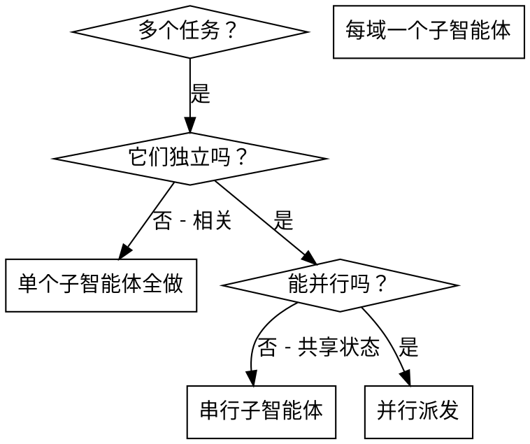

# 派发并行子智能体

## 概述

你把任务委派给具有隔离上下文的子智能体（通过子智能体调度）。通过精确构造它们的指令和上下文，你确保它们保持专注并在任务上成功。它们绝不继承你会话的上下文或历史——你构造它们需要的恰好内容。这也保留你自己的上下文用于协调工作。

当你有多个不相关的任务（不同模块、不同功能、不同文件），顺序执行浪费时间。每个任务独立，可以并行。

**核心原则**：每个独立问题域派发一个子智能体。让它们并发工作。

## 何时使用



**使用当：**
- 3+ 任务触及不同模块/文件
- 多个功能独立实现
- 每个任务无需其他任务的上下文就能理解
- 实现间无共享状态

**不要使用当：**
- 任务相关（一个的输出是另一个的输入）
- 需要理解完整系统状态
- 子智能体会编辑同一文件（冲突风险）

## 模式

### 1. 识别独立域

按触及面分组任务：
- 任务 A：实现 User Module（src/api/Module/User/）
- 任务 B：实现 Order Module（src/api/Module/Order/）
- 任务 C：实现 Auth Module（src/api/Module/Auth/）

每个域独立——实现 User 不影响 Order。

### 2. 创建聚焦的子智能体任务

每个子智能体获得：
- **具体范围**：一个模块/文件/功能
- **清晰目标**：让该任务的验收标准通过
- **约束**：不改其他模块代码
- **预期输出**：实现了什么 + 测试结果摘要

### 3. 并行派发

```
子智能体 A ← 实现用户模块（并行）
子智能体 B ← 实现订单模块（并行）
子智能体 C ← 实现认证模块（并行）
三个子智能体并发运行
```

### 4. 审查与集成

子智能体返回后：
- 读每个摘要
- 验证实现互不冲突
- 跑完整测试套件
- 集成所有改动

## 子智能体 prompt 结构

好的子智能体 prompt 是：
1. **聚焦** - 一个清晰的问题域
2. **自包含** - 理解任务所需的所有上下文
3. **明确输出** - 子智能体该返回什么？

```markdown
## 1. TASK
实现 change "add-user-auth" 的 task 1.2：创建用户数据模型

## 2. EXPECTED OUTCOME
- 创建：src/models/user.<项目后缀>
- 包含字段：id, username (unique), email (unique), created_at, updated_at
- 验证：项目的测试命令通过

## 3. REQUIRED CONTEXT
- 项目数据库用 PostgreSQL（不是 MySQL）
- 命名约定：参考 src/models/ 已有模型
- 无外键约束（详见 AGENTS.md）

## 4. MUST DO
- 遵循项目语言/框架的类型声明约定
- 字段类型必须明确声明
- 遵循现有模型文件风格（参考 src/models/ 已有文件）

## 5. MUST NOT DO
- 不要加外键
- 不要修改其他模型文件
- 不要创建对应的 Repository/DAO（那是 task 1.3 的事）

## 6. VERIFY
运行项目的测试命令，确认无报错
```

## 常见错误

**❌ 太广：** "修所有任务" - 子智能体会迷失
**✅ 具体：** "实现 task 1.2：创建 users 表迁移" - 范围聚焦

**❌ 没上下文：** "实现迁移" - 子智能体不知道约定
**✅ 有上下文：** 贴上项目约定和参考文件

**❌ 没约束：** 子智能体可能重构一切
**✅ 有约束：** "不要修改其他模块"/"只创建迁移文件"

**❌ 输出模糊：** "搞定" - 你不知道改了什么
**✅ 输出具体：** "返回创建的文件摘要 + migration 运行结果"

## 不要使用的情况

**相关任务：** 一个的输出是另一个的输入 - 串行执行
**需要完整上下文：** 理解需要看整个系统
**探索性工作：** 你还不知道什么坏了
**共享状态：** 子智能体会编辑同一文件（冲突风险）

## 真实示例

**场景：** change "order-api-impl" 有 5 个独立 task

**任务：**
- Task 2.1：实现 Domain 层（Entity + Repository interface）
- Task 2.2：实现 Application 层（Service）
- Task 2.3：实现 Interface 层（Controller + Request validation）
- Task 2.4：实现 Infrastructure 层（Repository impl）
- Task 2.5：注册路由

**决策：** 2.1/2.2/2.3/2.4 各在不同目录，可并行；2.5 依赖前 4 个完成

**派发：**
```
Agent 1 → 实现 Domain 层
Agent 2 → 实现 Application 层
Agent 3 → 实现 Interface 层
Agent 4 → 实现 Infrastructure 层
[等待全部完成]
主 Agent → 注册路由（依赖前 4 个的类名）
```

**集成：** 4 个独立目录无冲突，路由注册时引用各类名

**节省时间：** 4 个 task 并行 vs 顺序执行

## 关键好处

1. **并行化** - 多个实现同时进行
2. **聚焦** - 每个子智能体范围窄，跟踪的上下文少
3. **独立** - 子智能体互不干扰
4. **速度** - 4 个 task 用 1 个的时间解决

## 验证

子智能体返回后：
1. **审每个摘要** - 理解改了什么
2. **检查冲突** - 子智能体是否编辑了同一代码？
3. **跑完整套件** - 验证所有实现协同工作
4. **spec 合规** - 每个 task 是否符合其验收标准？

## 与 shw-apply 的集成

此 skill 是 `/shw-apply` 的决策层：
1. 读 tasks.md
2. 用此 skill 识别并行组
3. 用 6 段式 prompt 派发每个 task（TASK/EXPECTED OUTCOME/REQUIRED CONTEXT/MUST DO/MUST NOT DO/VERIFY）
4. 收集结果
5. 验证 + 集成
