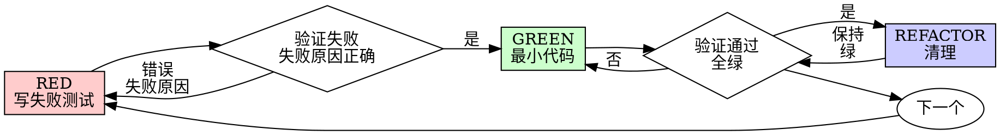

# 测试驱动开发（TDD）

## 概述

先写测试。看它失败。写最小代码让它通过。

**核心原则**：如果你没看过测试失败，你不知道它是否在测对的东西。

**违反规则的字面意义就是违反规则的精神。**

## 何时使用

**总是：**
- 新功能
- bug 修复
- 重构
- 行为变更

**例外（问你的用户）：**
- 一次性原型
- 生成的代码
- 配置文件

在想"就这次跳过 TDD"？停下。那是合理化借口。

## 铁律

```
没有失败测试在前，不写任何生产代码
```

先写了代码再写测试？删除它。重来。

**无例外：**
- 不要保留作为"参考"
- 不要"在写测试时改一改"
- 不要看它
- 删除就是删除

从测试出发重新实现。句号。

## Red-Green-Refactor



### RED - 写失败测试

写一个最小测试展示应该发生什么。

<Good>
```typescript
test('retries failed operations 3 times', async () => {
  let attempts = 0;
  const operation = () => {
    attempts++;
    if (attempts < 3) throw new Error('fail');
    return 'success';
  };

  const result = await retryOperation(operation);

  expect(result).toBe('success');
  expect(attempts).toBe(3);
});
```
名字清晰，测真实行为，只测一件事
</Good>

<Bad>
```typescript
test('retry works', async () => {
  const mock = jest.fn()
    .mockRejectedValueOnce(new Error())
    .mockRejectedValueOnce(new Error())
    .mockResolvedValueOnce('success');
  await retryOperation(mock);
  expect(mock).toHaveBeenCalledTimes(3);
});
```
名字模糊，测的是 mock 不是代码
</Bad>

**要求：**
- 一个行为
- 清晰的名字
- 真实代码（除非不可避免，否则不用 mock）

### 验证 RED - 看它失败

**强制步骤。绝不跳过。**

```bash
npm test path/to/test.test.ts
```

确认：
- 测试失败（不是报错）
- 失败信息是预期的
- 因功能缺失失败（不是 typo）

**测试通过？** 你在测已有行为。改测试。

**测试报错？** 修错，重跑直到正确失败。

### GREEN - 最小代码

写最简单的代码让测试通过。

<Good>
```typescript
async function retryOperation<T>(fn: () => Promise<T>): Promise<T> {
  for (let i = 0; i < 3; i++) {
    try {
      return await fn();
    } catch (e) {
      if (i === 2) throw e;
    }
  }
  throw new Error('unreachable');
}
```
刚好够通过
</Good>

<Bad>
```typescript
async function retryOperation<T>(
  fn: () => Promise<T>,
  options?: {
    maxRetries?: number;
    backoff?: 'linear' | 'exponential';
    onRetry?: (attempt: number) => void;
  }
): Promise<T> {
  // YAGNI（过度设计）
}
```
过度工程化
</Bad>

不要加功能、重构其他代码，或"改进"超出测试范围的东西。

### 验证 GREEN - 看它通过

**强制步骤。**

```bash
npm test path/to/test.test.ts
```

确认：
- 测试通过
- 其他测试仍通过
- 输出干净（无错误、警告）

**测试失败？** 改代码，不改测试。

**其他测试失败？** 立即修。

### REFACTOR - 清理

只在绿之后：
- 消除重复
- 改进命名
- 提取辅助函数

保持测试绿。不要加行为。

### 循环

为下一个功能写下个失败测试。

## 好测试

| 质量 | 好 | 坏 |
|---------|------|-----|
| **最小** | 只测一件事。名字里有 "and"？拆分它。 | `test('validates email and domain and whitespace')` |
| **清晰** | 名字描述行为 | `test('test1')` |
| **显示意图** | 展示期望的 API | 模糊化代码该做什么 |

## 为什么顺序重要

**"我之后写测试验证它工作"**

代码之后写的测试立即通过。立即通过证明不了什么：
- 可能测错东西
- 可能测实现而不是行为
- 可能漏掉你忘掉的边界情况
- 你从没见过它捕获 bug

测试先行强迫你看测试失败，证明它真的在测东西。

**"我已经手动测了所有边界情况"**

手动测试是随意的。你以为测了所有但：
- 没记录测了什么
- 代码改了不能重跑
- 压力下容易漏情况
- "我试过能用"≠ 全面

自动化测试是系统化的。每次跑都一样。

**"删掉 X 小时的工作太浪费"**

沉没成本谬误。时间已经过去了。你现在的选择：
- 删掉用 TDD 重写（X 个小时，高置信度）
- 保留它之后补测试（30 分钟，低置信度，可能有 bug）

"浪费"是保留无法信任的代码。没有真实测试的工作代码是技术债。

**"TDD 是教条主义，务实意味着变通"**

TDD 就是务实的：
- 提交前找 bug（比之后调试快）
- 防止回归（测试立即捕获破坏）
- 文档化行为（测试展示如何用代码）
- 使重构成为可能（自由改，测试捕获破坏）

"务实"的捷径 = 生产环境调试 = 更慢。

**"之后写测试达到同样目标 - 是精神不是仪式"**

不对。后写测试回答"这做什么？"先写测试回答"这应该做什么？"

后写测试受你实现的偏见。你测你做的，不是要求的。你验证记得的边界情况，不是发现的。

先写测试强迫在实现前发现边界情况。后写测试验证你记得了一切（其实没）。

30 分钟后写测试 ≠ TDD。你得到了覆盖率，失去了测试有效的证明。

## 常见合理化借口

| 借口 | 现实 |
|--------|---------|
| "太简单不需要测" | 简单代码也会崩。测试 30 秒。 |
| "我之后测" | 立即通过的测试证明不了什么。 |
| "后写测试达到同样目标" | 后写测试 = "这做什么？" 先写测试 = "这应该做什么？" |
| "已经手动测过" | 随意 ≠ 系统化。没记录，不能重跑。 |
| "删掉 X 小时太浪费" | 沉没成本谬误。保留未验证代码是技术债。 |
| "保留作参考，先写测试" | 你会改一改它。那就是后写测试。删除就是删除。 |
| "需要先探索" | 没问题。把探索代码扔掉，从 TDD 开始。 |
| "测试难写 = 设计不清晰" | 听测试的。难测 = 难用。 |
| "TDD 会拖慢我" | TDD 比调试快。务实 = 测试先行。 |
| "手动测更快" | 手动证明不了边界情况。每次改动都要重测。 |
| "现有代码没测试" | 你在改进它。为现有代码加测试。 |

## 红旗 - 停下重来

- 代码先于测试
- 测试在实现之后
- 测试立即通过
- 解释不了为什么测试失败
- 测试"以后"加
- 合理化"就这次"
- "我已经手动测过"
- "后写测试达到同样目的"
- "是精神不是仪式"
- "保留作参考"或"改现有代码"
- "已经花了 X 小时，删掉太浪费"
- "TDD 是教条，我务实"
- "这次不一样因为..."

**这些全意味着：删掉代码。从 TDD 重来。**

## 验证清单

标记工作完成前：

- [ ] 每个新函数/方法都有测试
- [ ] 实现前看过每个测试失败
- [ ] 每个测试因预期原因失败（功能缺失，不是 typo）
- [ ] 写了让每个测试通过的最小代码
- [ ] 所有测试通过
- [ ] 输出干净（无错误、警告）
- [ ] 测试用真实代码（只在不可避免时才 mock）
- [ ] 边界情况和错误已覆盖

不能勾全？你跳过了 TDD。重来。

## 卡住时

| 问题 | 解决 |
|---------|----------|
| 不知道怎么测 | 写期望的 API。先写断言。问你的用户。 |
| 测试太复杂 | 设计太复杂。简化接口。 |
| 必须 mock 一切 | 代码太耦合。用依赖注入。 |
| 测试 setup 巨大 | 提取辅助函数。还复杂？简化设计。 |

## 调试集成

发现 bug？写复现它的失败测试。走 TDD 循环。测试证明修复并防止回归。

绝不没有测试就修 bug。

## 测试反模式

添加 mock 或测试工具时，读 @testing-anti-patterns.md 避免常见陷阱：
- 测 mock 行为而不是真实行为
- 往生产类加只用于测试的方法
- 不理解依赖就 mock

## 最终规则

```
生产代码 → 测试存在且曾先失败
否则 → 不是 TDD
```

没有用户的许可，无例外。
