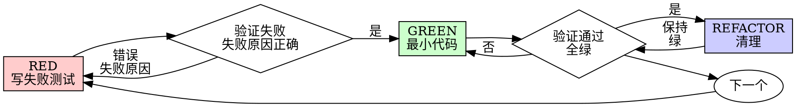

# 测试驱动开发（TDD）

## 概述

先写测试。看它失败。写最小代码让它通过。

**核心原则**：如果你没看过测试失败，你不知道它是否在测对的东西。

**违反规则的字面意义就是违反规则的精神。**

## 何时使用

**总是：**
- 新功能
- bug 修复
- 重构
- 行为变更

**例外（问你的用户）：**
- 一次性原型
- 生成的代码
- 配置文件

在想"就这次跳过 TDD"？停下。那是合理化借口。

## 铁律

```
没有失败测试在前，不写任何生产代码
```

先写了代码再写测试？删除它。重来。

**无例外：**
- 不要保留作为"参考"
- 不要"在写测试时改一改"
- 不要看它
- 删除就是删除

从测试出发重新实现。句号。

## Red-Green-Refactor



### RED - 写失败测试

写一个最小测试展示应该发生什么。

<Good>
```
测试 "失败操作重试 3 次":
    attempts = 0
    operation = 一个操作:
        attempts += 1
        如果 attempts < 3: 抛出 "失败"
        返回 "成功"

    result = retryOperation(operation)

    断言 result == "成功"
    断言 attempts == 3
```
名字清晰，测真实行为，只测一件事
</Good>

<Bad>
```
测试 "retry works":
    mock = 创建 mock:
        第 1 次调用: 抛出错误
        第 2 次调用: 抛出错误
        第 3 次调用: 返回 "成功"
    retryOperation(mock)
    断言 mock 被调用了 3 次
```
名字模糊，测的是 mock 不是代码
</Bad>

**要求：**
- 一个行为
- 清晰的名字
- 真实代码（除非不可避免，否则不用 mock）

### 验证 RED - 看它失败

**强制步骤。绝不跳过。**

```bash
npm test path/to/test.test.ts
```

确认：
- 测试失败（不是报错）
- 失败信息是预期的
- 因功能缺失失败（不是 typo）

**测试通过？** 你在测已有行为。改测试。

**测试报错？** 修错，重跑直到正确失败。

### GREEN - 最小代码

写最简单的代码让测试通过。

<Good>
```
function retryOperation(fn):
    重试最多 3 次 (i = 0 到 2):
        尝试:
            result = fn()
            返回 result
        捕获错误:
            如果 i == 2 (最后一次): 重新抛出错误
    # 此行不可达
```
刚好够通过
</Good>

<Bad>
```
function retryOperation(fn, options):
    options:
        maxRetries?: 默认值
        backoff?: 'linear' | 'exponential'
        onRetry?: 每次重试的回调
    # YAGNI（过度设计）
```
过度工程化
</Bad>

不要加功能、重构其他代码，或"改进"超出测试范围的东西。

### 验证 GREEN - 看它通过

**强制步骤。**

```bash
npm test path/to/test.test.ts
```

确认：
- 测试通过
- 其他测试仍通过
- 输出干净（无错误、警告）

**测试失败？** 改代码，不改测试。

**其他测试失败？** 立即修。

### REFACTOR - 清理

只在绿之后：
- 消除重复
- 改进命名
- 提取辅助函数

保持测试绿。不要加行为。

### 循环

为下一个功能写下个失败测试。

## 好测试

| 质量 | 好 | 坏 |
|---------|------|-----|
| **最小** | 只测一件事。名字里有 "and"？拆分它。 | `test('validates email and domain and whitespace')` |
| **清晰** | 名字描述行为 | `test('test1')` |
| **显示意图** | 展示期望的 API | 模糊化代码该做什么 |

## 为什么顺序重要

**"我之后写测试验证它工作"**

代码之后写的测试立即通过。立即通过证明不了什么：
- 可能测错东西
- 可能测实现而不是行为
- 可能漏掉你忘掉的边界情况
- 你从没见过它捕获 bug

测试先行强迫你看测试失败，证明它真的在测东西。

**"我已经手动测了所有边界情况"**

手动测试是随意的。你以为测了所有但：
- 没记录测了什么
- 代码改了不能重跑
- 压力下容易漏情况
- "我试过能用"≠ 全面

自动化测试是系统化的。每次跑都一样。

**"删掉 X 小时的工作太浪费"**

沉没成本谬误。时间已经过去了。你现在的选择：
- 删掉用 TDD 重写（X 个小时，高置信度）
- 保留它之后补测试（30 分钟，低置信度，可能有 bug）

"浪费"是保留无法信任的代码。没有真实测试的工作代码是技术债。

**"TDD 是教条主义，务实意味着变通"**

TDD 就是务实的：
- 提交前找 bug（比之后调试快）
- 防止回归（测试立即捕获破坏）
- 文档化行为（测试展示如何用代码）
- 使重构成为可能（自由改，测试捕获破坏）

"务实"的捷径 = 生产环境调试 = 更慢。

**"之后写测试达到同样目标 - 是精神不是仪式"**

不对。后写测试回答"这做什么？"先写测试回答"这应该做什么？"

后写测试受你实现的偏见。你测你做的，不是要求的。你验证记得的边界情况，不是发现的。

先写测试强迫在实现前发现边界情况。后写测试验证你记得了一切（其实没）。

30 分钟后写测试 ≠ TDD。你得到了覆盖率，失去了测试有效的证明。

## 常见合理化借口

| 借口 | 现实 |
|--------|---------|
| "太简单不需要测" | 简单代码也会崩。测试 30 秒。 |
| "我之后测" | 立即通过的测试证明不了什么。 |
| "后写测试达到同样目标" | 后写测试 = "这做什么？" 先写测试 = "这应该做什么？" |
| "已经手动测过" | 随意 ≠ 系统化。没记录，不能重跑。 |
| "删掉 X 小时太浪费" | 沉没成本谬误。保留未验证代码是技术债。 |
| "保留作参考，先写测试" | 你会改一改它。那就是后写测试。删除就是删除。 |
| "需要先探索" | 没问题。把探索代码扔掉，从 TDD 开始。 |
| "测试难写 = 设计不清晰" | 听测试的。难测 = 难用。 |
| "TDD 会拖慢我" | TDD 比调试快。务实 = 测试先行。 |
| "手动测更快" | 手动证明不了边界情况。每次改动都要重测。 |
| "现有代码没测试" | 你在改进它。为现有代码加测试。 |

## 红旗 - 停下重来

- 代码先于测试
- 测试在实现之后
- 测试立即通过
- 解释不了为什么测试失败
- 测试"以后"加
- 合理化"就这次"
- "我已经手动测过"
- "后写测试达到同样目的"
- "是精神不是仪式"
- "保留作参考"或"改现有代码"
- "已经花了 X 小时，删掉太浪费"
- "TDD 是教条，我务实"
- "这次不一样因为..."

**这些全意味着：删掉代码。从 TDD 重来。**

## 验证清单

标记工作完成前：

- [ ] 每个新函数/方法都有测试
- [ ] 实现前看过每个测试失败
- [ ] 每个测试因预期原因失败（功能缺失，不是 typo）
- [ ] 写了让每个测试通过的最小代码
- [ ] 所有测试通过
- [ ] 输出干净（无错误、警告）
- [ ] 测试用真实代码（只在不可避免时才 mock）
- [ ] 边界情况和错误已覆盖

不能勾全？你跳过了 TDD。重来。

## 卡住时

| 问题 | 解决 |
|---------|----------|
| 不知道怎么测 | 写期望的 API。先写断言。问你的用户。 |
| 测试太复杂 | 设计太复杂。简化接口。 |
| 必须 mock 一切 | 代码太耦合。用依赖注入。 |
| 测试 setup 巨大 | 提取辅助函数。还复杂？简化设计。 |

## 调试集成

发现 bug？写复现它的失败测试。走 TDD 循环。测试证明修复并防止回归。

绝不没有测试就修 bug。

## 测试反模式

**何时关注：** 写或改测试、加 mock、或想往生产代码加只用于测试的方法时。

测试必须验证真实行为，不是 mock 行为。mock 是隔离的手段，不是被测的对象。

**核心原则**：测代码做什么，不是测 mock 做什么。

**严格遵循 TDD 可以防止这些反模式。**

### 反模式铁律

```
1. 绝不测 mock 行为
2. 绝不往生产类加只用于测试的方法
3. 绝不在不理解依赖的情况下 mock
```

### 反模式 1：测 mock 行为

**违规：**
```
// ❌ 坏：测 mock 是否存在
测试 "渲染侧边栏":
    render(Page)
    断言 页面中存在测试 ID 为 "sidebar-mock" 的元素
```

**为什么错：**
- 你在验证 mock 工作，不是组件工作
- mock 在时测试通过，不在时失败
- 对真实行为一无所知

**修复：**
```
// ✅ 好：测真实组件，或不 mock 它
测试 "渲染侧边栏":
    render(Page)  // 不 mock sidebar
    断言 页面中存在 role 为 "navigation" 的元素

// 或者若必须为隔离 mock sidebar：
// 不要对 mock 断言 - 测 Page 在 sidebar 存在时的行为
```

#### 门禁函数

```
对任何 mock 元素断言之前：
  问："我在测真实组件行为，还是仅 mock 存在？"

  若在测 mock 存在：
    停下 - 删除断言或不 mock 该组件

  改测真实行为
```

### 反模式 2：生产代码里的测试专用方法

**违规：**
```
// ❌ 坏：destroy() 只在测试里用
class Session:
    方法 destroy():  // 看起来像生产 API！
        workspaceManager.destroyWorkspace(self.id)
        // ... 清理

// 测试里
每个测试后: session.destroy()
```

**为什么错：**
- 生产类被只用于测试的代码污染
- 在生产环境意外调用会很危险
- 违反 YAGNI 和关注点分离
- 把对象生命周期和实体生命周期搞混

**修复：**
```
// ✅ 好：测试工具处理测试清理
// Session 没有 destroy() - 它在生产里是无状态的

// 在 test-utils/
function cleanupSession(session):
    workspace = session.getWorkspaceInfo()
    如果 workspace 存在:
        workspaceManager.destroyWorkspace(workspace.id)

// 测试里
每个测试后: cleanupSession(session)
```

#### 门禁函数

```
往生产类加任何方法之前：
  问："这是否只被测试使用？"

  若是：
    停下 - 不要加
    放到测试工具里

  问："这个类是否拥有该资源的生命周期？"

  若否：
    停下 - 该方法放错了类
```

### 反模式 3：不理解就 mock

**违规：**
```
// ❌ 坏：mock 破坏了测试逻辑
测试 "检测重复 server":
    // mock 阻止了测试依赖的 config 写入！
    mock(ToolCatalog):
        discoverAndCacheTools: 返回 undefined（被 mock 掉了）

    addServer(config)
    addServer(config)  // 应抛错 - 但不会！
```

**为什么错：**
- 被 mock 的方法有测试依赖的副作用（写 config）
- 过度 mock 以"求稳"破坏了真实行为
- 测试因错误原因通过或神秘失败

**修复：**
```
// ✅ 好：在正确的层级 mock
测试 "检测重复 server":
    // mock 慢的部分，保留测试需要的行为
    mock(MCPServerManager)  // 只 mock 慢的 server 启动

    addServer(config)  // config 被写入
    addServer(config)  // 重复被检测 ✓
```

#### 门禁函数

```
mock 任何方法之前：
  停下 - 不要先 mock

  1. 问："真实方法有什么副作用？"
  2. 问："这个测试是否依赖其中任何副作用？"
  3. 问："我完全理解这个测试需要什么吗？"

  若依赖副作用：
    在更低层级 mock（实际慢/外部的操作）
    或用保留必要行为的测试替身
    不要 mock 测试依赖的高层方法

  若不确定测试依赖什么：
    先用真实实现跑测试
    观察实际需要发生什么
    然后在正确层级加最小 mock

  红旗：
    - "我 mock 这个以求稳"
    - "这可能慢，最好 mock"
    - 不理解依赖链就 mock
```

### 反模式 4：不完整的 mock

**违规：**
```
// ❌ 坏：部分 mock - 只有你认为需要的字段
mockResponse = {
    status: "success",
    data: { userId: "123", name: "Alice" }
    // 缺失：下游代码用的 metadata
}

// 后来：当代码访问 response.metadata.requestId 时崩溃
```

**为什么错：**
- **部分 mock 隐藏结构性假设** - 你只 mock 了知道的字段
- **下游代码可能依赖你没包含的字段** - 静默失败
- **测试通过但集成失败** - mock 不完整，真实 API 完整
- **虚假信心** - 测试证明不了真实行为

**铁律**：mock 真实存在的完整数据结构，不只是你当前测试用的字段。

**修复：**
```
// ✅ 好：镜像真实 API 完整性
mockResponse = {
    status: "success",
    data: { userId: "123", name: "Alice" },
    metadata: { requestId: "req-789", timestamp: 1234567890 }
    // 真实 API 返回的所有字段
}
```

#### 门禁函数

```
创建 mock 响应之前：
  检查："真实 API 响应包含哪些字段？"

  动作：
    1. 查文档/示例的真实 API 响应
    2. 包含系统可能在下游消费的所有字段
    3. 验证 mock 完全匹配真实响应 schema

  关键：
    若你在创建 mock，你必须理解整个结构
    部分 mock 在代码依赖被省略字段时静默失败

  若不确定：包含所有文档化字段
```

### 反模式 5：把集成测试当事后想

**违规：**
```
✅ 实现完成
❌ 没写测试
"准备好测试了"
```

**为什么错：**
- 测试是实现的一部分，不是可选的后续
- TDD 会捕获这个
- 没有测试不能声称完成

**修复：**
```
TDD 循环：
1. 写失败测试
2. 实现让它通过
3. 重构
4. 然后声称完成
```

### 当 mock 变得太复杂

**警告信号：**
- mock setup 比测试逻辑还长
- mock 一切让测试通过
- mock 缺真实组件有的方法
- mock 改了测试就崩

**用户的问题：** "我们真的需要这里用 mock 吗？"

**考虑：** 用真实组件的集成测试通常比复杂 mock 更简单

### TDD 防止这些反模式

**为什么 TDD 有帮助：**
1. **先写测试** → 强迫你想清楚到底在测什么
2. **看它失败** → 确认测试在测真实行为，不是 mock
3. **最小实现** → 不会混入只用于测试的方法
4. **真实依赖** → 你在 mock 前先看到测试实际需要什么

**若你在测 mock 行为，你违反了 TDD** - 你没先看测试对真实代码失败就加了 mock。

### 反模式快速参考

| 反模式 | 修复 |
|--------------|-----|
| 对 mock 元素断言 | 测真实组件或不 mock |
| 生产类的测试专用方法 | 移到测试工具 |
| 不理解就 mock | 先理解依赖，最小 mock |
| 不完整 mock | 完全镜像真实 API |
| 测试当事后想 | TDD - 测试先行 |
| 过度复杂 mock | 考虑集成测试 |

### 反模式红旗

- 断言检查 `*-mock` 测试 ID
- 只在测试文件里被调用的方法
- mock setup 超过测试的 50%
- 移除 mock 测试就失败
- 解释不了为什么需要 mock
- "以求稳"而 mock

### 反模式底线

**mock 是隔离的工具，不是被测的对象。**

若 TDD 揭示你在测 mock 行为，你走错了。

修复：测真实行为，或质疑为什么一开始要 mock。

## 最终规则

```
生产代码 → 测试存在且曾先失败
否则 → 不是 TDD
```

没有用户的许可，无例外。
